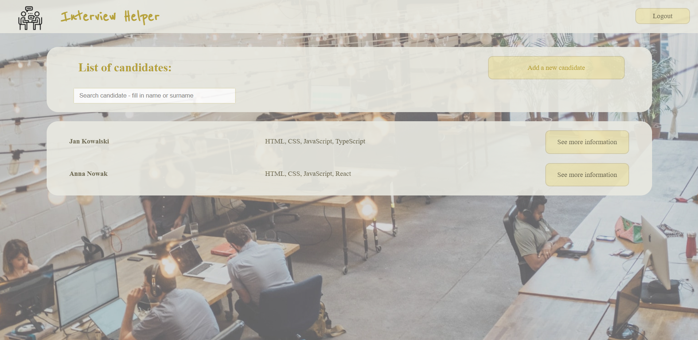
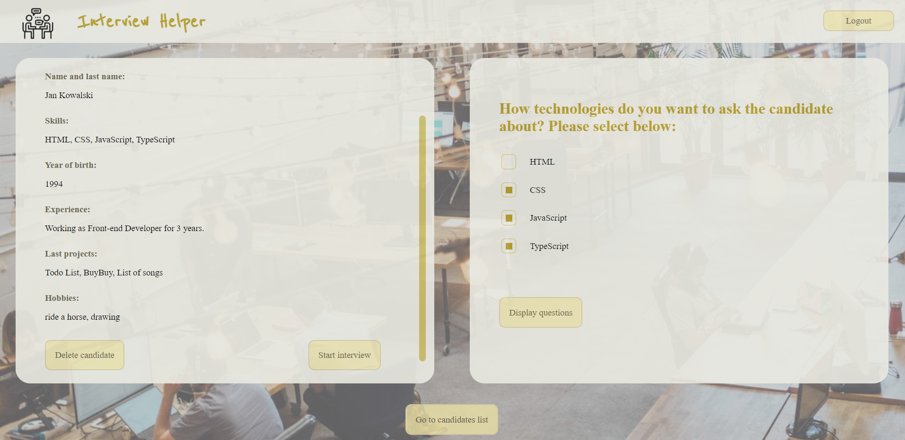
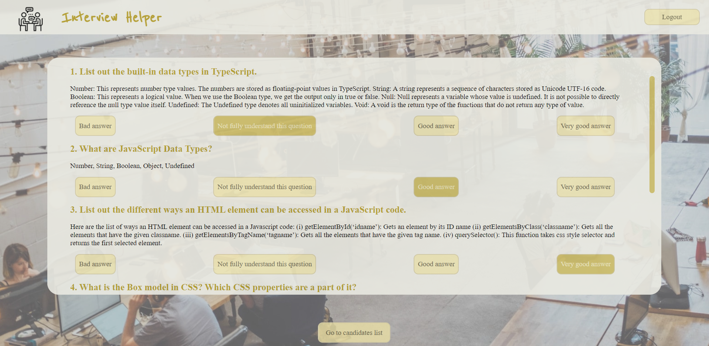
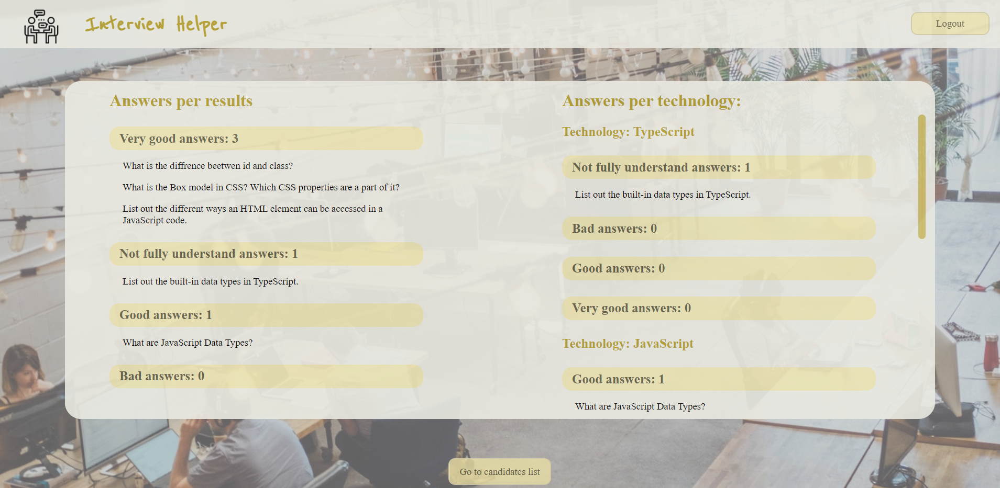

# Intervew Helper

## About

This app was created to help recruiters with the recruitment process.
To start you just need to click register or login.

## Technologies

- React
- CSS Modules
- Firebase

## How to start

In the project directory, you can run

```
npm install
```

and next

```
npm start
```

or you can go to link [Interview Helper Page](https://interview-helper-ih.web.app/)

## Views

After logging in you can see the list of candidates.



Click 'See more information' to see candidates view.

After you click at 'Start Interview' button you can choose the technologies.



Then you can choose questions from selected technologies.


That's all you need to do to start the interview!
Ask questions to the candidate and mark their answers.



When you'll finish job interview you will see the summary.
On the left: questions per results.
On the right: questions per technology and results.


